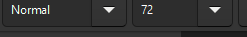

# Inkscape pour lesenfants

Étape 1 : Ouvrir Inkscape

    Ouvrez Inkscape sur votre ordinateur.

    Créez un nouveau document en cliquant sur "Nouveau Document".

    Sauvegarder le document en cliquant sur "Maj + Ctrl + s". Donner le nom "abc.svg". Sauver régulièrement ensuite au fur et à mesure des étapes, avec le raccourci "Ctrl + s".

Étape 2 : Dessiner un Rectangle

    Sélectionnez l'outil Rectangle dans la barre d'outils de gauche ou appuyez sur la touche "R".

    Cliquez et faites glisser votre souris pour dessiner un rectangle sur la page. Vous pouvez ajuster sa taille en utilisant les poignées de sélection.

    Sélectionnez le rectangle.

    Allez dans le menu "Objet" > "Fond et Contour".

    Dans le sous-onglet "Fond", sélectionnez sur l'icône avec la croix, ce qui signifie "Pas de remplissage".

    Dans l'onglet "Contour", choisissez rouge comme couleur de contour.

    Dans l'onglet "style du contour", choisissez la largeur du contour à 2 mm.

Étape 3 : Ajouter les Lettres ABC

    Sélectionnez l'outil Texte dans la barre d'outils de gauche ou appuyez sur la touche T.
    Cliquez à l'intérieur du rectangle et tapez les lettres "ABC".

    Choisir un contour vide.
    Pour le remplissage, choisir la couleur noire.

    Changez la taille et la police des lettres si nécessaire en utilisant la barre d'outils de texte en haut.

    Utilisez l'outil Sélection ou la touche S pour déplacer et ajuster les lettres afin qu'elles soient bien centrées à l'intérieur du rectangle.

    Vous devez obtenir un résultat similaire à celui-ci :

Voilà ! Vous avez maintenant un rectangle avec les lettres ABC.
